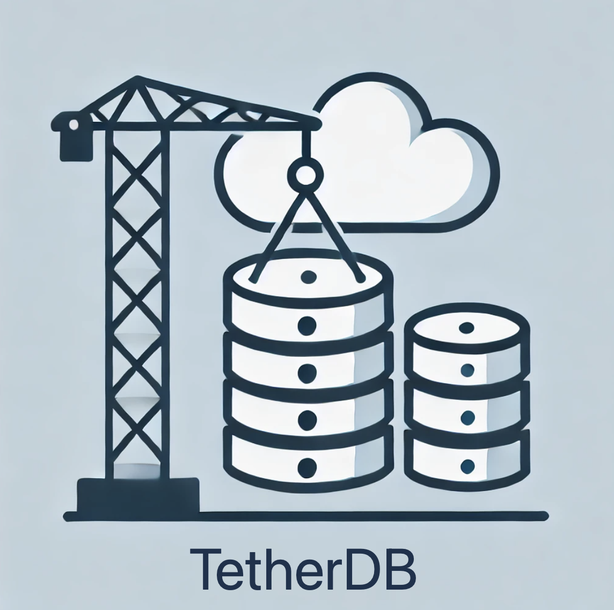

<div style="display: flex; align-items: flex-end;">
  
</div>
<br>

# A Hybrid Key-Value Store for Local, DynamoDB, and etcd Backends

## TetherDB is a flexible key-value store supporting

1. **Local storage** using `dbm` (SQLite3-backed in Python 3.13+).
2. **AWS DynamoDB** for scalable cloud storage.
3. **etcd** for distributed key-value storage with authentication and TLS support.

---

## Key Features

- **Hybrid Storage**: Write data to `local`, `DynamoDB`, or `etcd`.
- **Direct Writes or Queued Writes**:
  - Use direct writes for simplicity.
  - Use queued writes for background processing and performance.
- **Batch Processing**: Queued writes are processed in configurable batches.
- **Lifecycle Management**:
  - **`start()`**: Explicitly start a background worker for queued writes.
  - **`stop()`**: Gracefully stop the worker and clean up resources.
- **Buckets**: Organize keys with optional bucket prefixes, using : as the joining delimiter.
- **`tether` Decorator**: Write function outputs automatically to the database.
- **Debug Mode**: Enable detailed logs to track operations.
- **JSON Configuration**: Manage backends and advanced settings with a simple config file.

---

## Installation

### Prerequisites

- **Python 3.13+** (for SQLite3-backed `dbm`).
- **`boto3`**: For AWS DynamoDB integration.
- **`etcd3gw`**: For etcd support.

Install dependencies:

```bash
pip install boto3 etcd3gw
```

---

## Configuration

Create a JSON configuration file (`config.json`) to specify your backend settings.

### Example `config.json`

```json
{
  "debug": true,
  "local": {
    "filepath": "localdb"
  },
  "dynamodb": {
    "table_name": "MyDynamoDBTable"
  },
  "etcd": {
    "host": "localhost",
    "port": 2379,
    "username": "myuser",
    "password": "mypassword",
    "use_ssl": true,
    "cert_file": "path/to/client-cert.pem",
    "key_file": "path/to/client-key.pem",
    "ca_cert_file": "path/to/ca-cert.pem",
    "timeout": 5
  },
  "queue_batch": {
    "size": 5,
    "timeout": 2.0
  }
}
```

### etcd Configuration Options

| Parameter       | Type     | Description                                                        |
|------------------|----------|--------------------------------------------------------------------|
| `host`          | `str`    | Host address for the etcd server.                                  |
| `port`          | `int`    | Port for the etcd server.                                          |
| `username`      | `str`    | Username for etcd authentication (optional).                       |
| `password`      | `str`    | Password for etcd authentication (optional).                       |
| `use_ssl`       | `bool`   | Whether to enable SSL/TLS for secure communication. Default: `false`. |
| `cert_file`     | `str`    | Path to the client certificate file for SSL.                       |
| `key_file`      | `str`    | Path to the client key file for SSL.                               |
| `ca_cert_file`  | `str`    | Path to the CA certificate file for verifying the server.          |
| `timeout`       | `int`    | Connection and request timeout in seconds. Default: `5`.           |

---

## Initialization

```python
from TetherDB import DB

db = DB("config.json")
```

---

## Methods Overview

### 1. **`write_message`**

Write a key-value pair to the database **immediately**.

```python
db.write_message("key1", {"name": "Alice"}, bucket="users", backend="local")
```

| Parameter  | Type         | Description                                        |
|------------|--------------|----------------------------------------------------|
| `key`      | `str`        | Key for the data.                                  |
| `value`    | `dict`/`str` | Data to store. If `dict`, it is JSON-encoded.      |
| `bucket`   | `str`        | Bucket prefix for logical grouping (default: "").  |
| `backend`  | `str`        | Backend: `local`, `dynamodb`, or `etcd`.           |

---

### 2. **`write_queue_message`**

Queue a key-value pair for background writing. If the worker is not started, it starts automatically.

```python
db.write_queue_message("key2", {"name": "Bob"}, backend="etcd")
```

---

### 3. **`start`**

Explicitly start the background worker for queued writes.

```python
db.start()
```

---

### 4. **`stop`**

Gracefully stop the worker and clean up all resources.

```python
db.stop()
```

---

### 5. **`tether` Decorator**

The `tether` decorator writes the **return value** of a function to the database.

**Function Return Requirements**:

- The function **must return a dictionary** with the following keys:
  - `"key"`: (Optional) Custom key for the data. If not provided, a UUID is generated.
  - `"value"`: The data to store. **Must be a string (`str`) or a dictionary (`dict`)**.

If `value` is not a valid type, the operation will fail, and an error will be logged.

**Example 1: Custom Key**

```python
@db.tether(bucket="users", backend="local", wait=True)
def fetch_user():
    return {"key": "user:123", "value": {"name": "Alice", "role": "admin"}}

fetch_user()
```

**Example 2: Automatic UUID**

```python
@db.tether(bucket="configs", backend="etcd", wait=False)
def generate_config():
    return {"value": {"config_name": "auto-config", "status": "active"}}

generate_config()
```

**Example 3: Invalid `value` Type**

```python
@db.tether(bucket="errors", backend="local")
def invalid_data():
    return {"key": "invalid:123", "value": [1, 2, 3]}  # Invalid: list is not supported

invalid_data()
```

**Output**:

```
ERROR: Invalid 'value' type returned by 'invalid_data'. Expected str or dict, got list.
```

---

| Parameter  | Type         | Description                                                            |
|------------|--------------|------------------------------------------------------------------------|
| `bucket`   | `str`        | Bucket prefix for logical grouping (default: "").                      |
| `wait`     | `bool`       | If `True`, writes immediately. If `False`, queues the write.           |
| `backend`  | `str`        | Backend to use: `local`, `dynamodb`, or `etcd`. Default is `local`.    |

---

### Notes

- The `"value"` key **must** be a string (`str`) or dictionary (`dict`).
- If `"key"` is missing, a UUID is automatically generated.
- Invalid types (e.g., `list`, `set`) will cause an error to be logged, and the operation will not proceed.

## Usage Examples

### Direct Writes (Without Background Worker)

```python
db = DB("config.json")

# Write directly
db.write_message("key1", {"name": "Alice"}, backend="local")
db.write_message("key2", {"name": "Bob"}, backend="dynamodb")
```

---

### Queued Writes (With Background Worker)

TetherDB supports efficient background writes with batching. Messages are queued and written in batches based on:

- **Batch Size**: Maximum number of messages per batch (default: `10`).
- **Batch Timeout**: Time to wait (in seconds) before writing a batch (default: `2.0`).

Configure batch settings in `config.json`:

```json
"queue_batch": {
    "size": 5,
    "timeout": 2.0
}
```

**Example:**

```python
db = DB("config.json")

# Start the background worker
db.start()

# Queue messages for background writing
db.write_queue_message("key3", {"name": "Charlie"}, backend="etcd")
db.write_queue_message("key4", "Queued Example", backend="local")

db.stop()  # Gracefully stop the worker
```

---

### Using the `tether` Decorator

```python
db = DB("config.json")

@db.tether(key="user:123", bucket="users", backend="dynamodb")
def fetch_user():
    return {"name": "Alice", "role": "admin"}

fetch_user()
db.stop()
```

---

## Debug Mode

Enable debug mode in `config.json` to get detailed logs:

```json
"debug": true
```

Example debug output:

```
Local backend initialized at: localdb
Background worker started.
Message queued [local]: key3 -> {"name": "Charlie"}
Write successful to local backend: key3 -> {"name": "Charlie"}
Background worker stopped.
Database resources released and closed.
```

---

## Cleanup and Shutdown

Always call `stop()` to ensure the worker stops and resources are cleaned up:

```python
db.stop()
```

---

## Closing Thoughts

TetherDB is a flexible key-value store that works with local, DynamoDB, and etcd backends. It allows you to manage your database interactions efficiently using direct writes, queued writes, and an optional `tether` decorator for dynamic outputs.

- **Choose the backend** that fits your use case.
- **Start and stop workers** as needed for queued writes.
- **Enjoy flexibility and control** for both simple and advanced workflows.
