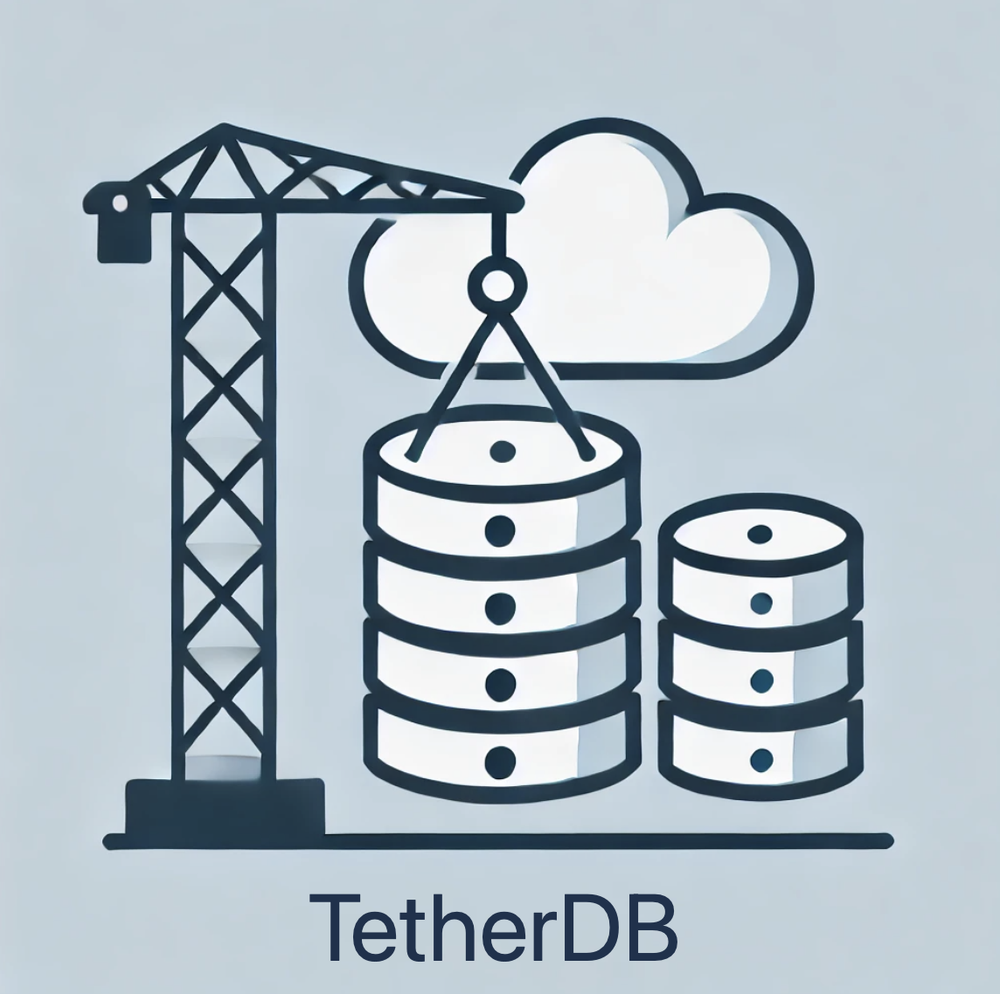

<div style="display: flex; align-items: flex-end;">
  
</div>
<br>

# TetherDB - A Hybrid Key-Value Store for Local, DynamoDB, and etcd Backends

TetherDB is a flexible key-value store supporting **local storage**, **AWS DynamoDB**, and **etcd** backends. It simplifies data storage, batch processing, and retrieval with features like queued writes, bucketed organization, and key listing with pagination.

---

## **Key Features**

- **Hybrid Storage**:
  - Local storage (`dbm`).
  - AWS DynamoDB for scalable cloud storage.
  - etcd for distributed key-value management.

- **Direct and Queued Writes**:
  - Direct writes save immediately (overwriting existing keys).
  - Queued writes optimize for batch processing with configurable batch size and interval.

- **Batch Processing**:
  - Configurable batch size and processing interval ensure efficient queued writes.

- **Message Listing**:
  - Retrieve and paginate keys with optional prefix-based filtering.

- **`tether` Decorator**:
  - Simplify function integration by writing return values automatically to the database.

- **Thread-Safe Design**:
  - Queued writes and batch processing are thread-safe, ensuring concurrency.

- **Concurrent Writes**:
  - Simulate concurrent writes and stress-test backend performance.

- **Context Manager Support**:
  - `DB` can be used directly or within a `with` statement for automatic resource management.

- **Easy Configuration**:
  - Pass configuration as a JSON file or Python dictionary.

---

## **Installation**

### **Prerequisites**

- **Python 3.11+**
- **`boto3`**: For AWS DynamoDB integration.
- **`etcd3gw`**: For etcd support.

Install dependencies:

```sh
pip install boto3 etcd3gw
```

---

## **Configuration**

TetherDB can be configured using either a **JSON file** or a **Python dictionary**.

### **Example `config.json`**

```json
{
  "logging": "debug",
  "queue_batch": {
    "size": 10,
    "interval": 2.0
  },
  "local": {
    "filepath": "localdb"
  },
  "dynamodb": {
    "table_name": "MyDynamoDBTable"
  },
  "etcd": {
    "host": "localhost",
    "port": 2379,
    "use_ssl": true,
    "cert_file": "cert.pem",
    "key_file": "key.pem",
    "ca_cert_file": "ca.pem",
    "timeout": 5
  }
}
```

### **Python Configuration Dictionary**

```python
config = {
    "logging": "debug",
    "queue_batch": {"size": 10, "interval": 2.0},
    "local": {"filepath": "localdb"},
    "dynamodb": {"table_name": "MyDynamoDBTable"},
    "etcd": {
        "host": "localhost",
        "port": 2379,
        "use_ssl": True,
        "cert_file": "cert.pem",
        "key_file": "key.pem",
        "ca_cert_file": "ca.pem",
        "timeout": 5
    }
}
```

---

## **Usage**

### **Initialize TetherDB**

You can initialize the database directly or use a context manager for automatic resource cleanup.

```python
from TetherDB import DB

# Option 1: Direct Initialization
db = DB(config_file="config.json")
db.start()

# Option 2: Using a Context Manager
with DB(config_file="config.json") as db:
    db.write_message("key1", {"data": "value1"}, backend="local")
```

---

### **Worker Management**

To use queued writes, ensure the worker is explicitly started:

```python
db.start()  # Start the worker
db.write_message("key1", {"data": "queued_value"}, backend="local", queue=True)
db.stop()   # Stop the worker to ensure pending writes are processed
```

---

### **Methods**

#### **`write_message`**

Write a key-value pair **immediately** (overwriting existing keys) or **queue** it for background processing.

```python
db.write_message("key1", {"name": "Alice"}, backend="local")
db.write_message("key2", "simple_value", backend="etcd", queue=True)
```

**Parameters**:

| Parameter   | Type         | Description                                       |
|-------------|--------------|---------------------------------------------------|
| `key`       | `str`        | Key for the data.                                 |
| `value`     | `dict`/`str` | Data to store. If `dict`, it is JSON-encoded.     |
| `bucket`    | `str`        | Optional bucket prefix for logical grouping.      |
| `backend`   | `str`        | Backend to use: `local`, `dynamodb`, or `etcd`.   |
| `queue`     | `bool`       | Queue for background write (default: `False`).    |

---

#### **`update_message`**

Update an existing key-value pair. If the key does not exist, the update will fail.

```python
db.write_message("existing_key", {"data": "value"}, backend="local")
success = db.update_message("existing_key", {"data": "updated_value"}, backend="local")
print(success)  # True
```

---

#### **`read_message`**

Retrieve a value by its key from the specified backend.

```python
value = db.read_message("key1", backend="local")
print(value)  # Output: {"name": "Alice"}
```

---

#### **`tether`** Decorator

Automatically write a function's return value to the database.

```python
@db.tether(bucket="logs", backend="local", queue=True)
def generate_log():
    return {"key": "log:001", "value": {"event": "UserLogin", "status": "Success"}}

generate_log()
```

---

## **Lifecycle Management**

```python
# Explicit Start/Stop
db.start()
db.stop()

# Context Manager for Automatic Cleanup
with DB(config_file="config.json") as db:
    db.write_message("key1", {"data": "value"}, backend="local")
```

---

## **Conclusion**

TetherDB simplifies key-value storage across local, cloud, and distributed backends. Its features include batch processing, decorators, and robust thread safety, making it ideal for scalable and concurrent applications.
